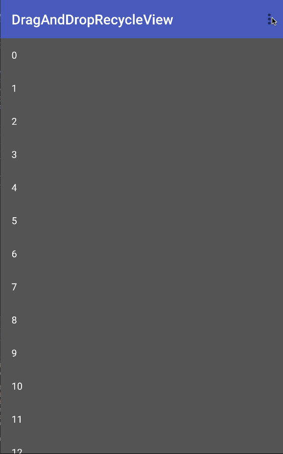

# DragAndDropRecycleView
Android  RecycleView which can Drag ,Drop and Scroll 

## 实现方式

该实现方式为原始的View.startDrag。

另外还有一个比较简单易懂的实现方式可以参考一下链接(但是那个只能在RecycleView内部拖动排序)

**[ItemTouchHelper Example](https://medium.com/@ipaulpro/drag-and-swipe-with-recyclerview-b9456d2b1aaf#.cxqwwugo1)**

#ScreenShot
效果图如下,真机上运行效果更佳：
